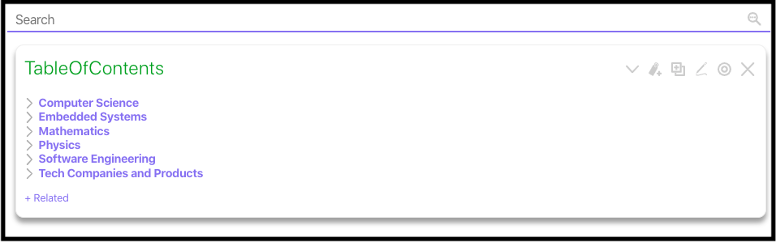

# Personal TiddlyWiki

## Overview

This site is a statically built version of my personal wiki that is used for work and school. All notes are of a personal nature and are probably not entirely accurate and need improvement. That is what improving is!

Please see the [active website for the wiki here](https://personal-wiki.tonyneuhold.com).

A screen shot preview is below:

## Update Instructions

Copy your personal TiddlyWiki HTML file into the root directory, and rename it to `index.html`. Then push those changes and Netlify will deploy 😄❇️. 